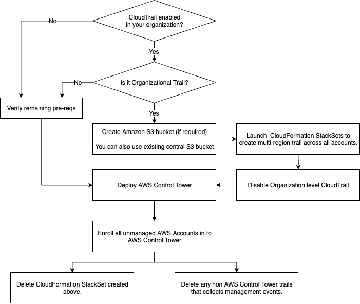

## aws-control-tower-existing-cloudtrail-integration

This repository is to support the code part of blog "How to integrate existing CloudTrail configurations when launching AWS Control Tower"

The blog is for customers looking to enable AWS Control Tower governance in their existing multi-account environments. 
You’ll learn how to efficiently enable AWS Control Tower in environments with existing CloudTrail trails. 
In addition, you will learn how to achieve this without interrupting your existing event-based workflows in a cost-efficient way. 

#### Prerequisites
1.	A few concepts, such as organization trails and landing zone referred to in this post, assume you have [AWS Organization enabled with all of its features](https://docs.aws.amazon.com/organizations/latest/userguide/orgs_manage_org_support-all-features.html).
2.	This solution is to be deployed only in your organizations management account.
3.	You need permissions to enable AWS Control Tower on your AWS account.
4.	Identify (or create) an S3 bucket to collect CloudTrail logs.
5.	Identity (or create) a [AWS Key Management Service (AWS KMS)](https://aws.amazon.com/kms/) key if you need to encrypt your CloudTrail logs.
6.	You must [enable organizations access](https://docs.aws.amazon.com/AWSCloudFormation/latest/UserGuide/stacksets-orgs-enable-trusted-access.html) to operate a service-managed stack set.

### Overview 

AWS Control Tower offers a simple way to set up and govern an AWS multi-account environment following prescriptive best practices. AWS Control Tower automatically creates CloudTrail trails when you enroll an AWS account using Account Factory. 

If you’re already using organization trails and want to install AWS Control Tower, you must disable the trusted access for CloudTrail to pass the AWS Control Tower pre-install checks. When you disable the trusted access, all of the organization trails in your accounts will become non-functional. When you enable AWS Control Tower in your existing organization, the management, audit, and log archive accounts are only enrolled by default. All of the remaining accounts must be enrolled separately. Once you enroll an account, AWS Control Tower configures a multi-region trail in the account and captures all of the events centrally in the S3 bucket located in the log archive account. 

It’s important to have at least one active trail in the accounts to avoid any interruptions to event-based workflows powered by Amazon EventBridge. Therefore, you could setup a temporary multi-region trails across all of the accounts before you disable trusted access for CloudTrail. If you skip this step, then you’ll lose the audit log collection, and any event-based workflows could be interrupted between the period when you disable the trusted access and launch AWS Control Tower. 

The following high-level steps make up this post:
1.	Prepare your environment
2.	Setup temporary multi-region trails
3.	Disable organization trails
4.	Install AWS Control Tower
5.	Enroll existing accounts and delete duplicate trails

#### High level steps

When you have multiple trails on an account, you incur costs for the additional copies of the events delivered. The steps mentioned in this post will create temporary trails in your AWS. These will result in increased costs during the transition time. The cost varies depending on the amount of activity in your accounts. Refer to the CloudTrail pricing page for details. 

To help manage costs, and avoid missing any audit log collection or impact event-based workflows, consider keeping both trails active for at least a couple of hours after you complete the transition/process. 

For additional information refer to [How to integrate existing CloudTrail configurations when launching AWS Control Tower](https://place-holder-until-blog-is-live) blog.

## Security

See [CONTRIBUTING](CONTRIBUTING.md#security-issue-notifications) for more information.

## License

This library is licensed under the MIT-0 License. See the LICENSE file.

